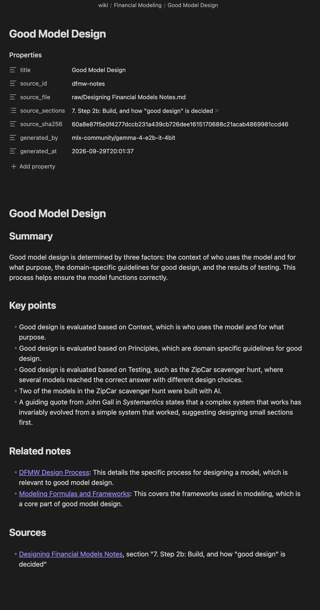
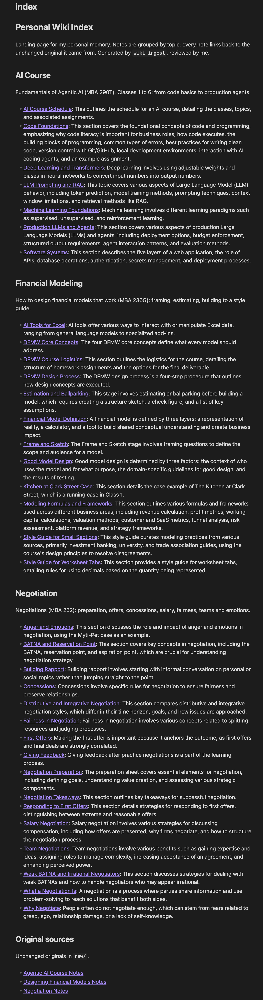
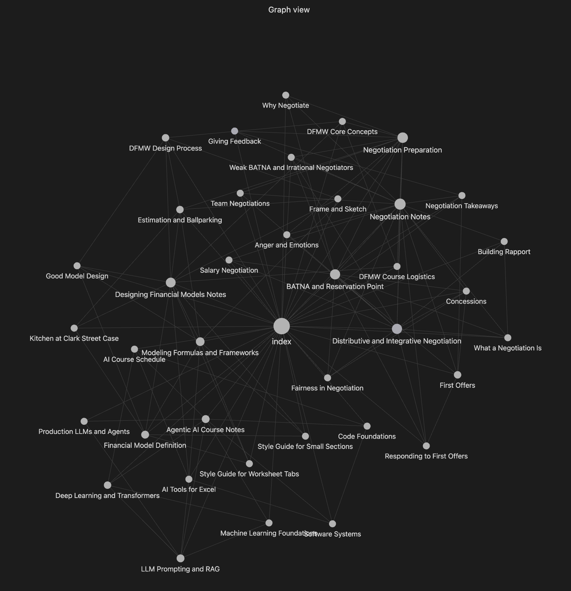

# Personal Wiki CLI with Local Gemma

A terminal program that answers questions about my own notes using Gemma 4 E2B running locally on my Mac, fully offline. Built for MBA 290T, Assignment 4.

**Where to look first**

| What | Link |
|---|---|
| Harness code | [`wiki_cli/`](wiki_cli/) |
| Instructions sent to Gemma | [`instructions/`](instructions/) |
| Wiki (open `vault/` in Obsidian) | [`vault/index.md`](vault/index.md) |
| Test plan, written before building | [`tests/questions.md`](tests/questions.md) |
| Final offline run: transcript and recording | [`evidence/transcripts/offline_run_3.txt`](evidence/transcripts/offline_run_3.txt), [`evidence/recordings/offline_run_3.mov`](evidence/recordings/offline_run_3.mov) |
| Every saved run | [`evidence/runs/`](evidence/runs/) |

## 1. Purpose and sources

This wiki is my personal study memory for three Fall 2026 Haas courses: Designing Financial Models that Work, Fundamentals of Agentic AI, and Negotiations. It should answer the concrete questions I have while preparing for classes, assignments and interviews (a style guide rule, a due date, what to do at a specific moment of a negotiation) and point me to the exact place in my notes where the answer lives.

| Source (unchanged original) | Wiki folder | Notes generated |
|---|---|---|
| [`vault/raw/Designing Financial Models Notes.md`](vault/raw/Designing%20Financial%20Models%20Notes.md) | `vault/wiki/Financial Modeling/` | 12 |
| [`vault/raw/Agentic AI Course Notes.md`](vault/raw/Agentic%20AI%20Course%20Notes.md) | `vault/wiki/AI Course/` | 7 |
| [`vault/raw/Negotiation Notes.md`](vault/raw/Negotiation%20Notes.md) | `vault/wiki/Negotiation/` | 16 |

The three sources are study notes I produced with AI assistance from the course slides and reference guides and then reviewed; they paraphrase the material in my own structure rather than copying it. They sit unchanged in `vault/raw/` and are the only evidence `ask` cites. `wiki ingest` sends each level 2 section of a source to Gemma, which drafts one wiki note per section (summary and key points). The note name comes from `config/sources.json`, and every note ends with a Sources section that links back to its original section, so any note can be traced back to its evidence.

## 2. Setup and device

**Device**

| Item | Value |
|---|---|
| OS | macOS 26.4 |
| Chip | Apple M5 |
| Memory | 16 GB unified memory (CPU and GPU share it) |
| Free disk | 167 GB at setup |
| Python | 3.14.7 |

**Model and runtime**

| Item | Value |
|---|---|
| Model | `mlx-community/gemma-4-e2b-it-4bit` (Gemma 4 E2B, instruction tuned) |
| Quantization | 4 bit (MLX format), 3.58 GB download |
| Runtime | MLX: `mlx-lm` 0.31.3, `mlx` 0.32.2 |
| Retrieval | Keyword search (BM25) in pure Python; no embedding model |
| Official source | https://huggingface.co/mlx-community/gemma-4-e2b-it-4bit (see also https://ai.google.dev/gemma/docs/integrations/mlx) |

My Mac is an Apple M5 with 16 GB of unified memory, so the model shares memory with everything else running. The class guidance for a 16 GB Mac is E2B or E4B, and MLX is the runtime recommended for Apple Silicon because it runs directly on the shared memory and GPU. Ollama had been installed in class; I switched to MLX and removed Ollama. E2B at 4 bit peaks at about 2.6 GB loaded and about 3.4 GB while answering, which leaves plenty of room, and it answers in about one second, so there was no reason to use a bigger model. The class slide lists the base model `gemma-4-e2b-4bit`; I used the instruction tuned `-it` version because a base model only continues text and would not follow rules like "cite the passages" or "say insufficient evidence". Gemma 4 also starts in a thinking mode that used up the whole token budget in my first test, so the harness switches thinking off.

**Measured on this Mac**

| Step | Time | Peak model memory | Evidence |
|---|---|---|---|
| Model load | 1.8 to 2.1 s | | `wiki doctor` output in transcript |
| Ingest, all 3 sources (35 notes, online) | 141.8 s | 3.38 GB | [ingest card](evidence/runs/20260929-200312-ingest.md) |
| Ingest, 1 source again (16 notes, offline) | 66.0 s | | [ingest card](evidence/runs/20260929-203320-ingest.md) |
| One ask answer (offline) | 0.8 to 1.2 s | 3.3 to 3.4 GB | [Test 1, run 3](evidence/runs/20260929-210006-ask.md) |

**Install (online, once)**

```
python3 -m venv .venv
source .venv/bin/activate
pip install -e .
mlx_lm.generate --model mlx-community/gemma-4-e2b-it-4bit --prompt "hi" --max-tokens 5   # downloads the model
wiki ingest vault/raw
```

**Every new Terminal window**

```
cd ~/haas-ai-a4-knowledge-hub
source .venv/bin/activate
```

**Commands**

```
wiki help                      # commands, folders, settings
wiki doctor                    # device, network status, model load test
wiki ingest vault/raw          # draft wiki notes, rebuild index.md and the search index
wiki ingest "vault/raw/Negotiation Notes.md" --force   # regenerate one source
wiki search "extreme first offer"                      # original passages only, no model
wiki ask "What font color should inputs be in a DFMW model?"
wiki chat                      # /notes <topic>, /reset, /help, /exit
```

Errors are reported in plain language: missing index ("run: wiki ingest vault/raw"), model not in the local cache, a path outside `vault/raw`, and `--mode online` (not implemented; local is the only mode).

## 3. Architecture

```
you type:  wiki ask "question"
   │
   ▼
cli.py        reads the command, picks the mode
   │
   ▼
modes.py      ask: retrieve, build prompt, call model, check citations, save
   │   ├── retrieval.py   BM25 search over data/chunks.json (219 passages from vault/raw)
   │   ├── prompts.py     research rules + passages [S1]..[S5] + question
   │   ├── model.py       local Gemma through MLX (thinking off, time and memory measured)
   │   ├── citations.py   every [S#] must match a retrieved passage
   │   └── evidence.py    saves a Markdown card and a JSON line in evidence/runs/
   ▼
answer with citations on screen
```

| Piece | What it is in this project |
|---|---|
| Model | Gemma 4 E2B, loaded by `model.py`; sees only the text the harness sends |
| Retrieval tool | `retrieval.py`; `wiki search` exposes it directly |
| RAG workflow | `run_ask` in `modes.py` |
| Harness | everything in `wiki_cli/`: modes, instructions, history, retrieval decisions, prompts, citation checks, errors, saved outputs |
| CLI | `cli.py`, the `wiki` command |

When I type `wiki ask "What font color should inputs be in a DFMW model?"`, `cli.py` sees the `ask` command and calls `run_ask` with only the question, so no chat history or persona can reach it. `retrieval.py` scores all 219 passages in `data/chunks.json` against the question and keeps the five best from `vault/raw`, each with its file and section. `prompts.py` builds one message: the research rules as the system instruction, then the five passages labeled [S1] to [S5], then my question. `model.py` sends it to Gemma through MLX and measures time and memory. `citations.py` checks that every [S#] in the answer points to a passage that was actually retrieved, and `evidence.py` saves the question, passages, answer, check and measurements as a card in `evidence/runs/`.

Chat works differently. It keeps a list of the last six exchanges and sends them with each new message, under the Coach persona. The harness, not the model, decides whether to look up notes: questions about what the assistant can do and edit requests such as "make that shorter" never retrieve; other messages retrieve only if the best passage scores at least 5.0; `/notes` forces a lookup. When notes are retrieved, the harness adds them plus a citation reminder at the end of the message.

## 4. Design choices

| Setting | Value | Where |
|---|---|---|
| Passage size | up to 220 words, split at headings, keeps file and section | `config.py`, `chunking.py` |
| Passages sent in ask | 5, from `vault/raw` only (never wiki summaries, never chat history) | `config.py`, `modes.py` |
| Ask floor | best score below 2.0 means insufficient evidence without calling Gemma | `config.py` |
| Chat retrieval | only if best score at least 5.0 and the message is not conversational or an edit request; `/notes` forces it | `modes.py` |
| Chat history | last 6 exchanges, plain messages only | `config.py` |
| Temperature | ask 0.1, chat 0.4, ingest 0.2 | `config.py` |
| Research rules | `instructions/wiki-instructions.md` | ask only |
| Persona ("The Coach") | `instructions/persona.md`, `instructions/capabilities.md` | chat only |
| Note names | fixed in `config/sources.json`, so re-ingest overwrites the same files | `ingest.py` |
| Duplicate guard | SHA-256 of each source in `data/manifest.json`; unchanged sources are skipped | `ingest.py` |

I chose keyword search (BM25) because it needs no extra model download, works with the model switched off (which `wiki search` requires), and is easy to inspect: I can see exactly why a passage scored high. The cost is that it matches words, not meaning, which is why Test 2 fails. I send five short passages instead of whole documents because a small model loses details in long text, a short prompt answers in about a second on a laptop, and each passage carries its file and section, so citations are precise. Ask never sees chat history because chat is where I brainstorm and may say things that are wrong; a claim made only in chat must never count as evidence, so ask takes only the question and retrieves only from the unchanged originals.

## 5. Evidence

### Obsidian

Graph filter: `path:wiki/`, attachments off.

| Open note with source reference | Index | Graph |
|---|---|---|
|  |  |  |

Re-ingesting a source offline updated the same 16 notes and created 0 new ones ([card](evidence/runs/20260929-203320-ingest.md)).

### Ask tests (all offline, Wi-Fi off, Terminal restarted)

Questions and expected sources were written first: [`tests/questions.md`](tests/questions.md).

| Test | Run 1 (v1) | Run 2 (v2) | Run 3 (v3, final) |
|---|---|---|---|
| 1. Input font color (direct) | ✅ [card](evidence/runs/20260929-203407-ask.md) | ✅ [card](evidence/runs/20260929-205139-ask.md) | ✅ royal blue [S1] [card](evidence/runs/20260929-210006-ask.md) |
| 2. Outrageous opening number (reworded) | ❌ retrieval miss, declined [card](evidence/runs/20260929-203459-ask.md) | ❌ same [card](evidence/runs/20260929-205209-ask.md) | ❌ same [card](evidence/runs/20260929-210025-ask.md) |
| 3. Two due dates (two sources) | ⚠️ only Oct 13 [card](evidence/runs/20260929-203522-ask.md) | ⚠️ only Oct 13 [card](evidence/runs/20260929-205255-ask.md) | ✅ Oct 13 [S3] and Oct 14 [S2] [card](evidence/runs/20260929-210054-ask.md) |
| 4. Negotiations final exam weight (unsupported) | ✅ declined [card](evidence/runs/20260929-203539-ask.md) | ✅ declined [card](evidence/runs/20260929-205329-ask.md) | ✅ declined [card](evidence/runs/20260929-210118-ask.md) |

A repeat of the four questions with v1 settings is also saved (20260929-2046 cards) with the same results as run 1.

I opened each cited passage. Test 1: [S1] is the Formatting part of the style guide, which says royal blue font for all constants (inputs), so the claim is supported. Test 3 (run 3): [S3] says Assignment 5 is due Tuesday October 13 at 11:59 pm PT and [S2] says the AI Modeler final project is due October 14 at 11:59 pm, so both claims are supported. Test 4: none of the five passages mention grade weights, so declining is correct. Test 2: the right passage (Negotiation Notes, section 9, "Extreme first offer") was not among the five retrieved, so Gemma correctly declined instead of guessing; the failure is in retrieval, not in the model.

### Chat and search checks

| Check | Run 1 | Run 2 | Run 3 (final) |
|---|---|---|---|
| "what can you help me with?" | ❌ no notes lookup (good) but no real capabilities | ❌ vague | ✅ real capabilities plus a starting point |
| 3 step salary plan from notes | ✅ cited | ❌ not cited | ✅ cited [S2] |
| "make that shorter" | ❌ asked a question | ✅ | ✅ |
| "in one sentence" / follow up | ❌ pulled unrelated notes | ✅ | ✅ |
| False claim "DFMW final due Oct 20" | ⚠️ not corrected | ❌ agreed | ⚠️ repeated Oct 20, then cited Oct 14 |
| Standalone ask after chat | ✅ Oct 14 | ✅ Oct 14 | ⚠️ said insufficient evidence although [S1] has Oct 14; chat claim did not leak |
| `wiki search "extreme first offer"` | ✅ section 9 ranked first, no generated answer | | |

Chat transcripts: [run 1](evidence/runs/20260929-203804-chat.md), [run 2](evidence/runs/20260929-205524-chat.md), [run 3](evidence/runs/20260929-210247-chat.md). Search: [card](evidence/runs/20260929-203326-search.md).

### What changed between runs

| Version | Change | Why |
|---|---|---|
| v2 | follow up edit requests skip retrieval; persona rules for capabilities, edits, contradictions; ask rule 6 (answer every part) | run 1 chat drifted to unrelated notes; Test 3 incomplete |
| v3 | harness appends capability list and citation reminders at the end of the message; ask puts the question after the passages; chat temperature 0.7 to 0.4 | run 2 showed the small model ignores rules buried in the system prompt |

### Offline proof

Every card in `evidence/runs/` records `network: offline (no internet connection)` except the first ingest. Recording: [`evidence/recordings/offline_run_3.mov`](evidence/recordings/offline_run_3.mov). Transcript: [`evidence/transcripts/offline_run_3.txt`](evidence/transcripts/offline_run_3.txt).

## 6. Reflection: limitation and improvement

The clearest failure is Test 2. My notes answer "What should I do if the other side opens with an outrageous number?" directly in section 9 under "Extreme first offer", but keyword search ranked DFMW rounding tips higher because the question and the right passage share almost no words. `wiki search "extreme first offer"` ranks section 9 first, which shows retrieval works with the notes' own wording and fails on paraphrase. The model behaved well: given the wrong passages, it said insufficient evidence instead of inventing advice. My improvement would be hybrid retrieval: download a small local embedding model while online, embed every passage during ingest, combine embedding similarity with the BM25 score, and rerun all four tests offline.

A second lesson came from the three runs. With a small model, rules buried in a long system prompt were followed inconsistently. Moving the reminders to the end of the message fixed Test 3 and the chat capability answer, but made the model over cautious on the standalone DFMW due date question, and chat still repeated my false October 20 date before citing October 14. Every prompt change therefore needs the full test set rerun, and checks that matter (like contradiction with the notes) are better enforced in code than requested in a prompt.
